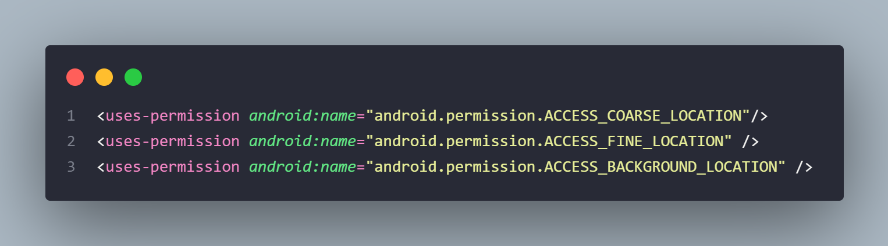

# React Native: utilizando geolocalização e mapas em aplicativos React Native:

## Criando o app

 

## Adicionando permissões para localização

No arquivo: **android/app/src/main/AndroidManifest.xml**

 

## Materiais Adicionais

https://reactnative.dev/

http://www2.decom.ufop.br/terralab/como-utilizar-geolocalizacao-em-seu-aplicativo-react-native/